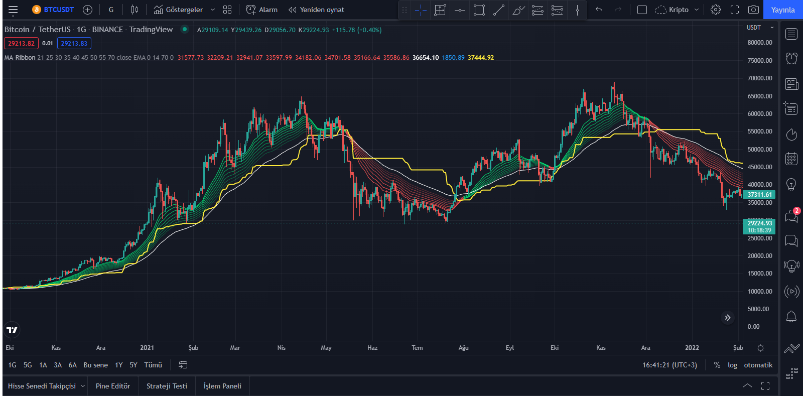

# MA-Ribbon Indicator

 MA-Ribbon Indicator For TradingView

  ### Warning Note:
 It is not for generating buy-sell signals. Gives an idea of ​​the trend direction.
 Making a trading decision with this indicator alone can have negative consequences!

### Screenshot

  </img>

### Code

```js
// This source code is subject to the terms of the Mozilla Public License 2.0 at https://mozilla.org/MPL/2.0/
// © GokhanAltun

//@version=4
study("MA-Ribbon", overlay = true)

// === Groups ===
ma_group = "Moving Average Settings"
hlma_group = "HLMA Settings"
atr_group = "ATR Settings"

// === Inputs ===
len1 = input(21, title = "MA-1 Length", type = input.integer, group = ma_group)
len2 = input(25, title = "MA-2 Length", type = input.integer, group = ma_group)
len3 = input(30, title = "MA-3 Length", type = input.integer, group = ma_group)
len4 = input(35, title = "MA-4 Length", type = input.integer, group = ma_group)
len5 = input(40, title = "MA-5 Length", type = input.integer, group = ma_group)
len6 = input(45, title = "MA-6 Length", type = input.integer, group = ma_group)
len7 = input(50, title = "MA-7 Length", type = input.integer, group = ma_group)
len8 = input(55, title = "MA-8 Length", type = input.integer, group = ma_group)
len9 = input(70, title = "MA-9 Length", type = input.integer, group = ma_group)

src = input(close, title = "Source", type = input.source, group = ma_group)
maType = input(title = "MA-Type", defval = "EMA", options = ["EMA", "SMA", "WMA"], group = ma_group)
ribbon_offset = input(0, title = "Ribbon Offset", type = input.integer, group = ma_group)


// === ATR Inputs === 
atr_len = input(14, title = "ATR-Length", type = input.integer, group = atr_group)


// === HLMA Inputs ===
hlmaActive = input(false, title = "HLMA ON", group = hlma_group)
hlma_len = input(100, title = "HLMA Length", group = hlma_group)
hlma_offset = input(0, title = "HLMA Offset", group = hlma_group)


// === Function ===
ma_type(src, len) =>
    if maType == "EMA"
        ema(src, len)
    else if maType == "SMA"
        sma(src, len)
    else if maType == "WMA"
        wma(src, len)


// === Outs ===
out1 = ma_type(src, len1)
out2 = ma_type(src, len2)
out3 = ma_type(src, len3)
out4 = ma_type(src, len4)
out5 = ma_type(src, len5)
out6 = ma_type(src, len6)
out7 = ma_type(src, len7)
out8 = ma_type(src, len8)
out9 = ma_type(src, len9)


// === Function ===
get_color_code() =>
    if out8 > 0
        if out1 > out8
            #00E676
        else
            #FF5252
    else
        #787B86


// === Plot ==
colorCode = get_color_code()
plot(out1, title = "MA-1", color = color.new(colorCode, 0), linewidth = 1, offset = ribbon_offset)
plot(out2, title = "MA-2", color = color.new(colorCode, 10), linewidth = 1, offset = ribbon_offset)
plot(out3, title = "MA-3", color = color.new(colorCode, 20), linewidth = 1, offset = ribbon_offset)
plot(out4, title = "MA-4", color = color.new(colorCode, 30), linewidth = 1, offset = ribbon_offset)
plot(out5, title = "MA-5", color = color.new(colorCode, 40), linewidth = 1, offset = ribbon_offset)
plot(out6, title = "MA-6", color = color.new(colorCode, 50), linewidth = 1, offset = ribbon_offset)
plot(out7, title = "MA-7", color = color.new(colorCode, 60), linewidth = 1, offset = ribbon_offset)
plot(out8, title = "MA-8", color = color.new(colorCode, 70), linewidth = 1, offset = ribbon_offset)
plot(out9, title = "MA-9", color = color.white, linewidth = 1, offset = ribbon_offset)
plot(atr(atr_len), title = "Atr", color = color.new(color.blue, 100))

// === HLMA ===
hlma() =>
    hlma_out = avg(highest(hlma_len), lowest(hlma_len))

plot(hlmaActive ? hlma() : na, color = color.yellow, offset = hlma_offset, linewidth = 2)
```